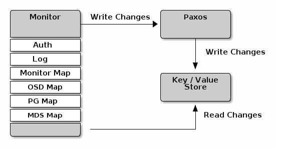
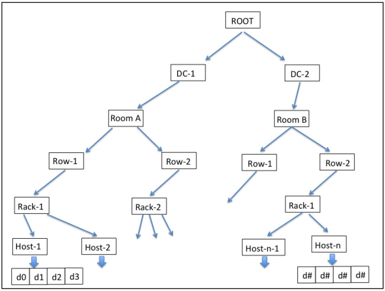

## Ceph monitor.
- Các Ceph monitors lưu một "master copy" của cluster map, có nghĩa là một ceph client có thể xác định vị trí của tất cả Ceph monitors, Ceph OSD Daemons và Ceph metadata servers mà chỉ cần kết nối tới một Ceph monitor và lấy về một bản cluster map. Trước khi ceph client có thể đọc ghi vào Ceph OSD Daemon hoặc Ceph Metadata Servers, nó phải kết nối với Ceph Monitor trước. Với một bản sao cluster map và thuật toán CRUSH, ceph client có thể tính ra vị trí của bất kỳ object nào. Khả năng tính vị trí object này cho phép ceph client nói chuyện trực tiếp với OSD daemon, điều này rất quan trọng cho hiệu năng của ceph.
- Vai trò chính của Ceph Monitor là duy trì một bản copy của cluster map. Ceph Monitor cũng cung cấp dịch vụ xác thực và ghi log. Ceph monitor ghi tất cả những thay đổi trong dịch vụ monitor vào Paxos, Paxos ghi thay đổi này vào `key/store`

	
	
- Các monitors chịu tránh nhiệm giám sát trạng thái của toàn bộ hệ thống. Có các daemons giữ trạng thái của các thành viên trong cluster bằng cách lưu thông tin của cluster, trạng thái của mỗi node, thông tin cấu hình cluster. Ceph monitor giữ một bản sao master của cluster. Cluster map bao gồm monitor, OSD, PG, CRUSH, và MDS maps. Tập hợp các map này được gọi là cluster map. Chức năng cơ bản của mỗi map:
	- Monitor map: Lưu thông tin về các monitor node. Thông tin bao gồm ID cluster, hostname, IP và port. Monitor cũng lưu thông tin như lúc khởi tạo và lần cuối thay đổi.
	- OSD map: Lưu các thông tin như là ID cluster, epoch tạo OSD map và lần cuối cùng thay đổi; và các thông tin liên quan đến pools như là pool name, pool ID, type, số lượng replication, và PG (placement groups). Các thông tin về osd như là count, state, weight, last clean interval, và osd host.
	- PG map: map này lưu giữ các phiên bản của PG (thành phần quản lý các object trong ceph), timestamp, bản OSD map cuối cùng, tỉ lệ đầy và gần đầy dung lượng. Nó cũng lưu các ID của PG, object count, tình trạng hoạt động và srub (hoạt động kiểm tra tính nhất quán của dữ liệu lưu trữ).
	- CRUSH map: lưu các thông tin của các thiết bị lưu trữ trong Cluster, các rule cho từng vùng lưu trữ.
	- MDS map: lưu thông tin về thời gian tạo và chỉnh sửa, dữ liệu và metadata pool ID, cluster MDS count, tình trạng hoạt động của MDS, epoch của MDS map hiện tại.
	

## 1 Monitor map.
- Monitor map cho chúng ta biết thông tin về toàn bộ monitors trên cluster
- Một số lệnh sau để xem monitor map

```sh
root@cephaio:~# ceph mon stat
e1: 1 mons at {cephaio=10.10.10.11:6789/0}, election epoch 6, quorum 0 cephaio

root@cephaio:~# ceph mon dump
dumped monmap epoch 1
epoch 1
fsid fe7cd007-6da4-4ea6-b04b-754b0e3c64de
last_changed 2017-12-22 09:43:45.690505
created 2017-12-22 09:43:45.690505
0: 10.10.10.11:6789/0 mon.cephaio
```

## 2. OSD map
- <cập nhật sau>

## 3. PG map
- Lệnh tạo mới một pool

```sh
ceph osd pool create {pool-name} pg_num
```

- Khi tạo pool cần chỉ rõ tham số `pg_num`. Ở đây có một vài giá trị thường dùng:
	- Ít hơn 5 OSDs đặt pg_num = 128
	- Từ 5 đến 10 OSDs đặt pg_num = 512
	- Từ 10 đến 50 OSDs đặt pg_num = 1024
	- Nếu nhiều hơn 50 OSDs thì phải tính toán phù hợp theo yêu cầu.
	
- Khi mà số lượng OSDs tăng lên, việc đặt giá trị pg_num chính xác là rất quan trọng vì nó ảnh hưởng lớn đến việc xử lý của cluster cũng như đảm bảo dữ liệu an toàn khi có lỗi gì đó xảy ra.

### Placement group được sử dụng như thế nào?
- Placement group (PG) tập hợp các objects trong một pool
	
	

- Ceph client sẽ tính PG mà object sẽ thuộc vào. Việc tính toán này được thực hiện bằng cách băm object ID và áp dụng cho một tác vụ dựa trên số lượng PGs được định nghĩa trong pool và Id của pool.
- Nội dung trên trong một PG được lưu trong một bộ OSDs. Ví dụ, một pool có số replicate là 2, mỗi PG sẽ lưu các object trên 2 OSDs.

	
	
- Khi số lượng PG tăng lên, các PG mới sẽ được gán vào các OSDs. CRUSH cũng sẽ thay đổi và một số object từ PGs cũ sẽ được sao chép tới PG mới và xóa từ PG cũ.
- Sau khi một OSD gặp sự cố, nguy cơ mất dữ liệu tăng lên cho đến khi dữ được chứa trong osd đó được khôi phục lại toàn bộ. Một số kịch bản gây ra mất dữ liệu vĩnh viễn trong một PG:
	- OSD hư hỏng và toàn bộ bản sao của object mà osd chứa bị mất. Với tất cả các object có bản sao ở trong osd đều bị giảm từ 3 xuống 2.
	- Ceph bắt đầu khôi phục OSD này bằng cách chọn một osd mới để tạo lại bản copy thứ 3 của tất cả các object đó.
	- Một OSD khác, trong cùng PG đó, hỏng trước khi OSD mới sao chép toàn bộ copy thứ 3. Một số object chỉ còn lại một bản sao.
	- Ceph chọn một OSD khác và giữ các đối tượng sao chép để khôi phục số lượng bản sao mong muốn
	- Một OSD thứ 3, trong cùng PG này, hỏng trước khi khôi phục hoàn thành. Nếu OSD này chứa bản sao duy nhất còn lại của object thì object đó bị mất hoàn toàn.
	
- Trong cluster chứa 10 OSDs với 512 PG và 3 bản sao, CRUSH sẽ cho mỗi PG 3 OSDs. Như vậy mỗi OSD sẽ phải chứa lên đến (512*3)/10 = ~150 PGs. Khi OSD đầu tiên hỏng, ceph sẽ phải khôi phục tất cả 150 PG cùng lúc.
- 150 PGs được phục hồi có thể lan ra 9 OSD còn lại. Mỗi OSD còn lại gửi bản sao của objects tới tất cả OSD khác và cũng nhận các objects mới bởi vì chúng trở thành một phần của PG mới.
- Lượng thời gian để khôi phục hoàn toàn phụ thuộc vào kiến trúc của cluster.

### Cách tính số PG.
- PG là rất quan trọng, ảnh hưởng đến hiệu năng cũng như độ an toàn của dữ liệu.
- Công thức tính số PG cho mỗi pool như sau

	
	
- `pool size` là số lượng replicate cho pool hoặc K + M cho erasure coded pools.

- Link tham khảo: http://docs.ceph.com/docs/master/rados/operations/placement-groups/
## 4. CRUSH map
- Hệ thống lưu trữ sẽ phải lưu phần data và metadata của nó. Metadata, là dữ liệu của dữ liệu, lưu thông tin như nơi data được lưu trong chuỗi các node storage và các disk. Mỗi lần dữ liệu mới được thêm vào, metadata của nó sẽ được cập nhật trước khi dữ liệu được lưu. Việc quản lý metadata rất phức tạp và khó khăn khi dữ liệu lớn.
- Ceph sử dụng thuật toán `Controlled Replication Under Scalable Hashing (CRUSH)` để thực hiện lưu trữ và quản lý dữ liệu.
- Thuật toán CRUSH dùng để tính toán nơi dữ liệu sẽ được lưu hoặc nơi dữ liệu sẽ được đọc. Thay vì lưu trữ metadata, CRUSH tính metadata dự trên yêu cầu.
- CRUSH tính metadata chỉ khi có yêu cầu. Quá trình tính toán này được biết với tên gọi CRUSH lookup.
- Với yêu cầu đọc và ghi, đầu tiên client liên hệ với monitor và tìm một bản copy của cluster map. Cluster map giúp client biết trạng thái và cấu hình của cluster. Data sẽ được biến đổi thành các objects. Sau đó object sẽ được băm với số PG để sinh ra một PG không thay đổi trong ceph pool. Sau khi tính xong PG, CRUSH lookup xác định primary OSD để lưu và tìm kiếm data. ID của OSD primary được gửi cho client, client sẽ làm việc trực tiếp với OSD để lưu dữ liệu. Tất cả các thao tác tính toán đều được thực hiện bởi client, do đó không ảnh hưởng đến hiệu năng của cluster. 
- Một khi data dược ghi lên primary OSD, trên cùng node đó thực hiện một tác vụ CRUSH lookup và tính vị trí secondary PG và các OSD, nơi mà data sẽ được sao chép.

	

### Cấu trúc phân cấp của CRUSH
- CRUSH là cơ sở để hiểu ceph và hoàn toàn có khả năng cấu hình; nó duy trì một phân cấp lồng nhau cho tất cả các thành phần của cơ sở hạ tầng của bạn. Danh sách các thiết bị CRUSH thường gồm có disk, node, rack, row, switch, dòng điện, room, data center, etc. Những thành phần này được gọi là failure zones hoặc CRUSH buckets.
- CRUSH map chứ danh sách các buckets để tập hợp các thiết bị vào trong vị trí vật lý. Và một danh sách các rule để cho CRUSH biết cách sao chép data cho các ceph pool khác nhau. Hình sau sẽ mô tả tổng quan về CRUSH map.

	

<Đang cập nhật>


