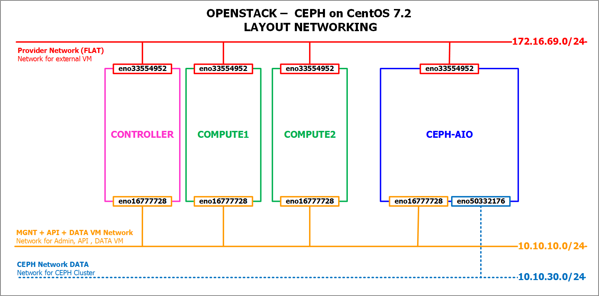
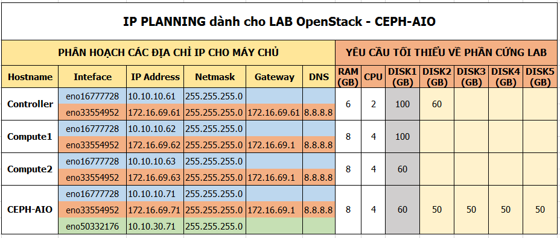

# Hướng dẫn cài đặt CEPH sử dụng `ceph-deploy` trên 1 máy duy nhất (CEPH AIO)

## 1. Mục tiêu LAB
- Mô hình này sẽ cài tất cả các thành phần của CEPH lên một máy duy nhất, bao gồm:
  - ceph-deploy
  - ceph-admin
  - mon
  - OSD
- Máy CEPH AIO được cài đặt để có thể sẵn sàng tích hợp với hệ thống OpenStack
- LAB này chỉ phù hợp với việc nghiên cức các tính năng và demo thử nghiệm, không áp dụng được trong thực tế.

## 2. Mô hình 
- Sử dụng mô hình dưới để cài đặt CEPH AIO, nếu chỉ dựng CEPH AIO thì chỉ cần một máy CEPH. 


## 3. IP Planning
- Phân hoạch IP cho các máy chủ trong mô hình trên, nếu chỉ dựng CEPH-AIO thì chỉ cần quan tâm tới node CEPH-AIO


## 4. Chuẩn bị và môi trường LAB
 
- OS
  - CentOS Server 7.2 64 bit
  - 05: HDD, trong đó:
    - `sda`: sử dụng để cài OS
    - `sdb`: sử dụng làm `journal` (Journal là một lớp cache khi client ghi dữ liệu, thực tế thường dùng ổ SSD để làm cache)
    - `sdc, sdd, sde`: sử dụng làm OSD (nơi chứa dữ liệu của client)
  - 02 NICs: 
    - `eno16777728`: dùng client (các máy trong OpenStack) sử dụng, sử dụng dải 10.10.10.0/24
    - `eno33554952`: dùng để ssh và tải gói cho máy chủ CEPH AIO, sử dụng dải172.16.69.0/24
    - `eno50332176`: dùng để replicate cho CEPH, dải 10.10.30.0/24
  
- CEPH Jewel

## 5. Cài đặt CEPH

- Đặt hostname cho máy cài AIO
  ```sh
  hostnamectl set-hostname cephAIO  
  ```

- Thiết lập IP cho máy CEPH AIO
  ```sh
  echo "Setup IP  eno16777728"
  nmcli c modify eno16777728 eno16777728.addresses 10.10.10.71/24
  nmcli c modify eno16777728 eno16777728.method manual

  echo "Setup IP  eno33554952"
  nmcli c modify eno33554952 eno33554952.addresses 172.16.69.71/24
  nmcli c modify eno33554952 eno33554952.gateway 172.16.69.1
  nmcli c modify eno33554952 eno33554952.dns 8.8.8.8
  nmcli c modify eno33554952 eno33554952.method manual

  echo "Setup IP  eno50332176"
  nmcli c modify eno50332176 eno50332176.addresses 10.10.30.71/24
  nmcli c modify eno50332176 eno50332176.method manual
  ```
  
- Vô hiệu hóa Selinux
  ```sh
  sed -i 's/SELINUX=enforcing/SELINUX=disabled/g' /etc/sysconfig/selinux
  ```

- Cấu hình các thành phần mạng cơ bản
  ```sh
  sudo systemctl disable firewalld
  sudo systemctl stop firewalld
  sudo systemctl disable NetworkManager
  sudo systemctl stop NetworkManager
  sudo systemctl enable network
  sudo systemctl start network
  ```

- Sửa file host 
  ```sh
  echo "10.10.10.71 cephAIO" >> /etc/hosts
  ```
- Tạo user `ceph-deploy`
```sh
sudo useradd -d /home/ceph-deploy -m ceph-deploy
```

- Đặt mật khẩu cho user `ceph-deploy`
  ```sh
  sudo passwd ceph-deploy
  ```

- Phân quyền cho user `ceph`
  ```sh
  echo "ceph-deploy ALL = (root) NOPASSWD:ALL" | sudo tee /etc/sudoers.d/ceph
  echo "Defaults:ceph-deploy !requiretty" | sudo tee -a /etc/sudoers.d/ceph
  
  sudo chmod 0440 /etc/sudoers.d/ceph
  ```

- Chuyển sang user `ceph-deploy`
  ```sh
  su - ceph-deploy
  ```

- Tạo ssh key cho user `ceph-deploy`
  ```sh
  ssh-keygen -t rsa
  ```

- Khai báo repos cho CEPH 

```sh
sudo yum install -y yum-utils
sudo yum-config-manager --add-repo https://dl.fedoraproject.org/pub/epel/7/x86_64/ 
sudo yum install --nogpgcheck -y epel-release 
sudo rpm --import /etc/pki/rpm-gpg/RPM-GPG-KEY-EPEL-7 
sudo rm /etc/yum.repos.d/dl.fedoraproject.org*
```
 
```sh
cat << EOF > /etc/yum.repos.d/ceph.repo
[Ceph-noarch]
name=Ceph noarch packages
baseurl=http://download.ceph.com/rpm-jewel/el7/noarch
enabled=1
gpgcheck=1
type=rpm-md
gpgkey=https://download.ceph.com/keys/release.asc
priority=1
```

- update sau khi khai báo repo
```sh
sudo yum -y update
```

- Cài đặt `ceph-deploy` 
```sh
sudo yum install -y ceph-deploy
```

- Tạo thư mục để chứa các file cần thiết cho việc cài đặt CEPH 
```sh
mkdir cluster-ceph
cd cluster-ceph
```

- Thiết lập các file cấu hình cho CEPH.
  ```sh
  ceph-deploy new cephAIO
  ```

- Sau khi thực hiện lệnh trên xong, sẽ thu được 03 file ở dưới (sử dụng lệnh `ll -alh` để xem). Trong đó cần cập nhật file `ceph.conf` để cài đặt CEPH được hoàn chỉnh.
  ```sh
  ceph-deploy@cephAIO:~/my-cluster$ ls -alh
  total 20K
  drwxrwxr-x 2 ceph-deploy ceph-deploy 4.0K Apr 12 17:11 .
  drwxr-xr-x 5 ceph-deploy ceph-deploy 4.0K Apr 12 17:11 ..
  -rw-rw-r-- 1 ceph-deploy ceph-deploy  198 Apr 12 17:11 ceph.conf
  -rw-rw-r-- 1 ceph-deploy ceph-deploy 3.2K Apr 12 17:11 ceph-deploy-ceph.log
  -rw------- 1 ceph-deploy ceph-deploy   73 Apr 12 17:11 ceph.mon.keyring
  ceph-deploy@cephAIO:~/my-cluster$
  ```

- Thêm các dòng dưới vào file `ceph.conf` vừa được tạo ra ở trên
  ```sh
  echo "osd pool default size = 2" >> ceph.conf
  echo "osd crush chooseleaf type = 0" >> ceph.conf
  echo "osd journal size = 8000" >> ceph.conf
  echo "public network = 10.10.10.0/24" >> ceph.conf
  echo "cluster network = 10.10.30.0/24" >> ceph.conf
  ```
  
- Cài đặt CEPH, thay `cephAIO` bằng tên hostname của máy bạn nếu có thay đổi.
  ```sh
  ceph-deploy install cephAIO
  ```

- Cấu hình `MON` (một thành phần của CEPH)
  ```sh
  ceph-deploy mon create-initial
  ```

- Sau khi thực hiện lệnh để cấu hình `MON` xong, sẽ sinh thêm ra 03 file : `ceph.bootstrap-mds.keyring`, `ceph.bootstrap-osd.keyring` và `ceph.bootstrap-rgw.keyring`. Quan sát bằng lệnh `ll -alh`

  ```sh
  ceph-deploy@cephAIO:~/my-cluster$ ls -alh
  total 96K
  drwxrwxr-x 2 ceph-deploy ceph-deploy 4.0K Apr 12 17:20 .
  drwxr-xr-x 5 ceph-deploy ceph-deploy 4.0K Apr 12 17:11 ..
  -rw------- 1 ceph-deploy ceph-deploy  113 Apr 12 17:20 ceph.bootstrap-mds.keyring
  -rw------- 1 ceph-deploy ceph-deploy  113 Apr 12 17:20 ceph.bootstrap-osd.keyring
  -rw------- 1 ceph-deploy ceph-deploy  113 Apr 12 17:20 ceph.bootstrap-rgw.keyring
  -rw------- 1 ceph-deploy ceph-deploy  129 Apr 12 17:20 ceph.client.admin.keyring
  -rw-rw-r-- 1 ceph-deploy ceph-deploy  342 Apr 12 17:14 ceph.conf
  -rw-rw-r-- 1 ceph-deploy ceph-deploy  54K Apr 12 17:20 ceph-deploy-ceph.log
  -rw------- 1 ceph-deploy ceph-deploy   73 Apr 12 17:11 ceph.mon.keyring
  -rw-r--r-- 1 root        root        1.7K Oct 16  2015 release.asc
  ```

- Tạo các OSD cho CEPH, thay `cephAIO` bằng tên hostname của máy bạn 
  ```sh
  ceph-deploy osd prepare cephAIO:sdc:/dev/sdb
  ceph-deploy osd prepare cephAIO:sdd:/dev/sdb
  ceph-deploy osd prepare cephAIO:sde:/dev/sdb
  ```

- Active các OSD vừa tạo ở trên
  ```sh
  ceph-deploy osd activate cephAIO:/dev/sdc1:/dev/sdb1
  ceph-deploy osd activate cephAIO:/dev/sdd1:/dev/sdb2
  ceph-deploy osd activate cephAIO:/dev/sde1:/dev/sdb3
  ```
  
