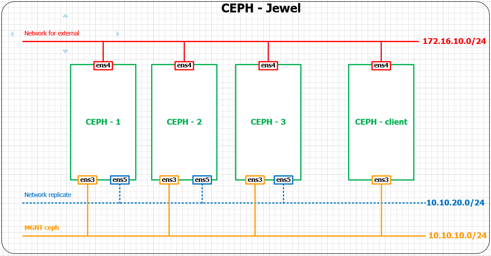

## Sử dụng Ceph block cơ bản
- Sau khi thực hiện deploy một cluster ceph theo [hướng dẫn](./ceph_jewel_deploy_ubuntu_16.04.md), thực hiện một số thao tác cơ bản với ceph block.

- Sử dụng một node ceph-client được nối mạng như mô hình sau:

	
	

## Cài đặt môi trường.
- 1. Cài đặt môi trường cho node ceph-client

- Cấu hình route.
- Sửa file `/etc/hostname`

```sh
cephclient
```

- Sửa file `/etc/hosts`

```sh
10.10.10.21	ceph1
10.10.10.22	ceph2
10.10.10.23	ceph3
10.10.10.100	cephclient
```

- Cấu hình card mạng. `vi /etc/network/interfaces`

```sh
auto ens3
iface ens3 inet static
address 10.10.10.100
netmask 255.255.255.0

auto ens4
iface ens4 inet dhcp
```

- Cài đặt các gói ceph.

```sh
wget -q -O- 'https://download.ceph.com/keys/release.asc' | sudo apt-key add -
echo deb https://download.ceph.com/debian-jewel/ $(lsb_release -sc) main | sudo tee /etc/apt/sources.list.d/ceph.list
apt update
```

-  Tạo user ceph-deploy để sử dụng cho việc cài đặt cho CEPH.
- Tạo user

```sh
sudo useradd -m -s /bin/bash ceph-deploy
```

- Đặt mật mẩu cho user ceph-deploy

```sh
sudo passwd ceph-deploy
```

- Phân quyền cho user ceph-deploy

```sh
echo "ceph-deploy ALL = (root) NOPASSWD:ALL" | sudo tee /etc/sudoers.d/ceph-deploy
sudo chmod 0440 /etc/sudoers.d/ceph-deploy
```

- Cài đặt ceph trên client

```sh
apt install -y ceph-common
```

## Thực hiện trên ceph1
- Thêm dòng sau vào `/etc/hosts`

```sh
10.10.10.100	cephclient
```

- Tạo pool cho client

```sh
ceph osd pool create pool_client 128 128
```

- Chuyển file ceph.conf sang các node cephclient

```sh
ssh cephclient sudo tee /etc/ceph/ceph.conf < /etc/ceph/ceph.conf
```

- Tạo các ceph user cho client

```sh
ceph auth get-or-create client.user1 mon 'allow r' osd 'allow class-read object_prefix rbd_children, allow rwx pool=pool_client'
```

-  Chuyển key của user1 sang node cephclient

```sh
ceph auth get-or-create client.user1 | ssh cephclient sudo tee /etc/ceph/ceph.client.user1.keyring
ssh cephclient sudo chmod +r /etc/ceph/ceph.client.user1.keyring
```
---
- Xong các bước cài đặt

## Thực hiện tạo pool và sửa dụng. Thực hiện trên node cephclient
- Tạo block1 

```sh
rbd create pool_client/block1 --size 1024 --image-feature layering -n client.user1 -k /etc/ceph/ceph.client.user1.keyring
```

- Map block1

```sh
# sudo rbd map pool_client/block1 -n client.user1 -k /etc/ceph/ceph.client.user1.keyring
/dev/rbd0
```

- Định dạng block1

```sh
~# mkfs.ext4 -m0 /dev/rbd0
mke2fs 1.42.13 (17-May-2015)
Discarding device blocks: done
Creating filesystem with 262144 4k blocks and 65536 inodes
Filesystem UUID: ae1dc8f5-ba7f-44bd-a855-618b53f8384d
Superblock backups stored on blocks:
        32768, 98304, 163840, 229376

Allocating group tables: done
Writing inode tables: done
Creating journal (8192 blocks): done
Writing superblocks and filesystem accounting information: done
```

- Mount `/dev/rbd0` để sử dụng

```sh
mount /dev/rbd0 /mnt
```

- Kiểm tra các mount point

```sh
~# df -h
Filesystem                   Size  Used Avail Use% Mounted on
udev                         468M     0  468M   0% /dev
tmpfs                         98M  4.6M   93M   5% /run
/dev/mapper/ubuntu--vg-root   19G  1.9G   16G  11% /
tmpfs                        488M     0  488M   0% /dev/shm
tmpfs                        5.0M     0  5.0M   0% /run/lock
tmpfs                        488M     0  488M   0% /sys/fs/cgroup
/dev/sda1                    472M  106M  342M  24% /boot
tmpfs                         98M     0   98M   0% /run/user/0
/dev/rbd0                    976M  1.3M  959M   1% /mnt
```

- Tạo file trong /mnt để kiểm tra lại

```sh
~# touch /mnt/file1
~# ls /mnt/
file1  lost+found
```

- Sau khi reboot, client sẽ không tự động mount lại. Chúng ta phải cấu hình để client tự động mount lại khi reboot
- Sửa file `/etc/ceph/rbdmap`

```sh
pool_client/block1      id=user1,keyring=/etc/ceph/ceph.client.user1.keyring
```

- Sửa file `/etc/fstab`

```sh
/dev/rbd0   /mnt  ext4 defaults,noatime,_netdev        0       0
```